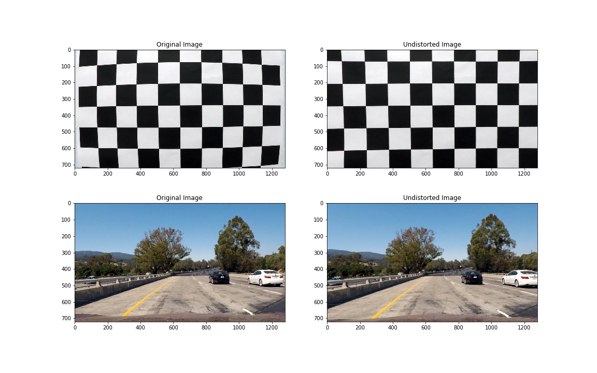

Self-Driving Lane Lines Detection 
=======
Introduction
-------
Self-driving, as the same meaning of autonomous car or driverless car, is a vehicle that is capable of sensing its environment 
and moving with little or no human input. It does a significant convenience to human's real life. One of self-driving sensor is
camera, driverless car uses a front-facing camera to collect the environment information and produces real-time video to help the car sensing 
the situation. So detecting the lane lines is a very important issue, this project is to create a improved lane finding 
algorithm using computer vision techniques. The core of this project is to identify the lane boundry in the camera video. This 
peoject is mainly about these below sections. 
This project is mainly to write a python algerithm to identify the lane boundary from a front facing camera.

## Section 1: Camera Calibration
When a camera captures 3D objects in the real world it transforms them into 2D images, this transform is not exact and modifies
the objects shape and size. In order to correct the distortion of we need to analyze images generated by the camera, calitrate
it and use the distortion parameters to correct other images taken with it.

### Distortion Measurement
In this project, chessboard pattern is used to measure the distortion of a camera. We use OpenCV to do this measurement. 
OpenCV provides several functions such as findChessboardCorners(), drawChessboardCorners(), to find and draw corners on an
chessboard pattern image. The main algerithm is, we assuming the chessboard pattern is fixed on the (x,y) plane at z=0 while the 
real world coordinate is (x,y,z). ''Object points'' represents the corners and on the (x,y) plane is the same for each calibration
image. ''imgpoints'' is append with (x,y) pixel position of each corners in the image plane. And an example of corner detection 
is shown as below:

### Camera Matrix and Distortion Coefficients
This part we use the function cv2.calibrateCamera() to get the camera matrix and distortion coefficients.

### Image Undistortion
In this part we define a function named undistortion() to correct the distortion of a certain image. This defined function 
is mainly using the cv2.undistort() function and camera matrix and distortion coefficients calculated in the last part. And a sample
results is shown as below:

## Section 2: Color and Gradient Threshold
Color and gradient thresholds are used to identify the lane markings. This part is mainly about running the image through an 
almost empirical combination of methods that process color channels and gradients in order to create a binary image that just 
contains the lane pixels

### Binary Image
As we know, in the real driving road, shadows and glares are quite challenge for lane detection, so here we use a adaptive thresholds
which is described below arose.
A red channel image is used to find white line, and we make a linear combination between the red and saturation channel
(where sat_hls returns a given color image) to detect the yellow line. And a example for yellow line detection is shown as below:

### Birds' Eye Transformation
As we know, parallel lines appear to converge on an image taken from the front facing camera of the car due to the perspective.
Birds' eye transformation is applied to keep parallel line parallel. We shrink the bottom edge of an image and produce the same
scale of the road to the top of the image. This transformation preserves all avaliable pixels from the original image on the top
of the image where we have lower resolution.
Here we use cv2.getPerspectiveTransform()function to implement the Birds' eye transformation. We also define a function transform()
to get the warped image from the original. Of course this test image is undistorted before the transformation. And a sample images
showing original, undistorted and warped image are shown as below:

## Section 3: The Lane Class
Once the pixels corresponding to the lane lines are dentified in section2, curve fitting can be done to detrmine the driable 
region, in order to facilitate book-keeping, a python class definiton for the lane making lines was used.

## Section 4: Curve Fitting Strategy
This function fits a 2nd order polynomial to the image coordinates returned by lane identification algorithm. These coordinates
could be the centroids of the sliding convolutional windows (newly identified lane line) or all the pixel identified within the
margin (previously identified lane line). 

## Section 5: Visualization
This part will make a visualization of the intermediate video at each section described above. The drivable lane region is superimposed on the original video frames (undistorted) along with status of dropped frame for easy
visualization. 

### Author: Yufei Wang
